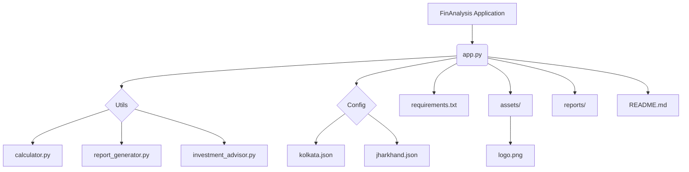

 ## FinAnalysis is a simple yet powerful Streamlit web application designed to help you:
- Analyze your personal financial situation
- Get personalized investment advice
- Download professional PDF financial reports

---

## ✨ Features
- **Financial Analysis** based on user inputs.
- **Personalized Investment Suggestions** based on income, family size, city, and savings goals.
- **PDF Report Generation** with summary & insights.
- **Interactive UI** built using Streamlit.

---

## 🛠️ Tech Stack
- Python 3.x
- Streamlit
- FPDF
- Markdown & Basic HTML

---

## 📂 Project Structure


---

## 🤝 Contributing
Contributions are welcome! Please open issues or PRs to improve FinAnalysis 🚀

Project Link: [https://github.com/DivyanshJain04/FinAnalysis](https://github.com/DivyanshJain04/FinAnalysis)
```
